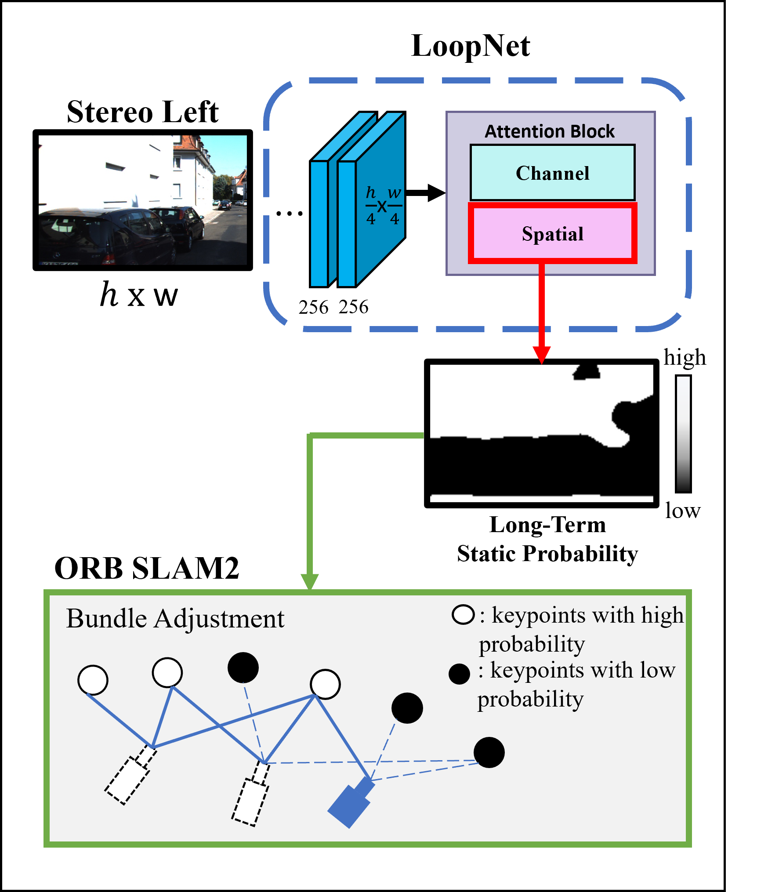
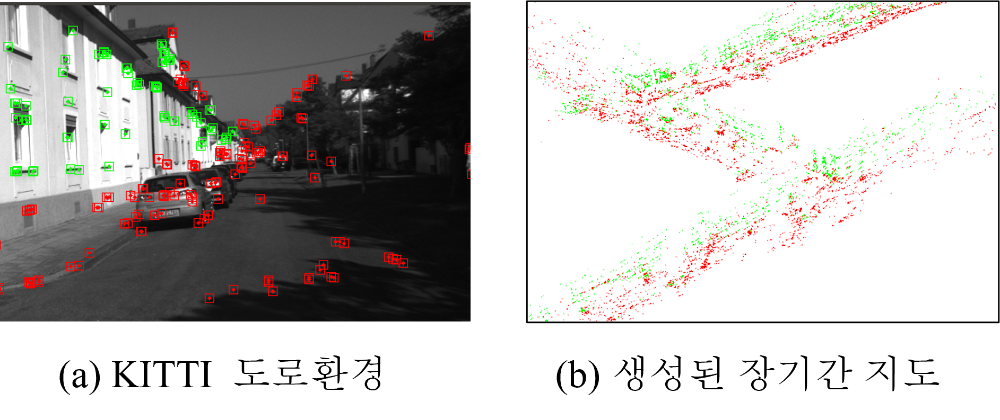

# orbprob_map_viewer
Make a long-term map using ORB SLAM2[1] and LoopNet[2].

### Framework

### Map

### 구현내용
- LoopNet의 spatial attention을 활용하여 동적인 환경의 장면에서 장기간 SLAM에 적합한 영역을 인식합니다.
- 해당 영역은 나무와 자동차, 지면과 같은 환경이 아닌 건물의 외벽등이 포함됩니다.
- 인식된 장면은 ORB SLAM2에 스테레오 카메라의 local과 global bundle adjustment에 반영됩니다.

## implemention

- LoopNet의 구현 및 학습은 [LoopNet 구현](https://github.com/JeonHyeongJunKW/dynamic_detect_model)을 통해서 하였습니다.
- 학습된 모델은 /src/python 경로에 main.pth로 넣어서 사용하면됩니다.

## 설치간 주의사항 

- Pangolin : https://github.com/stevenlovegrove/Pangolin/releases/tag/v0.6 을 설치할 것
- 학습된 모델은 /src/python 경로에 main.pth로 넣을 것
- 파이썬은 3.8버전과 cuda가 가능한 gpu가 존재해야함.

### 진행사항 
22-12-08 : Python 라이브러리를 활용하여 모델로부터 마스크를 얻어왔습니다. 또한 마스크에서 낮은 확률을 가지는 장면내 요소를 인식하였습니다.

22-12-08 : map point를 기반으로 3차원 점을 시각화하였습니다. 각 점의 색깔은 3차원점의 확률에 따라서 다르게 나타납니다.

### Reference

[1] R. Mur-Artal and J. D. Tard ́os, “ORB-SLAM2: an opensource SLAM system for monocular, stereo and RGB-D

cameras,” IEEE Transactions on Robotics, vol. 33, no. 5, pp. 1255–1262, 2017.

[2]B. Bescos and J. M. Facil, J. Civera, and J. Neira, “DynaSLAM: Tracking, Mapping, and Inpainting in

dynamic Scenes,” IEEE Robotics andAutomation Letters, vol. 3, no. 4, pp. 4076–4083, oct 2018. 